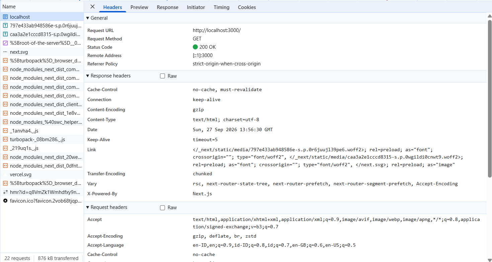
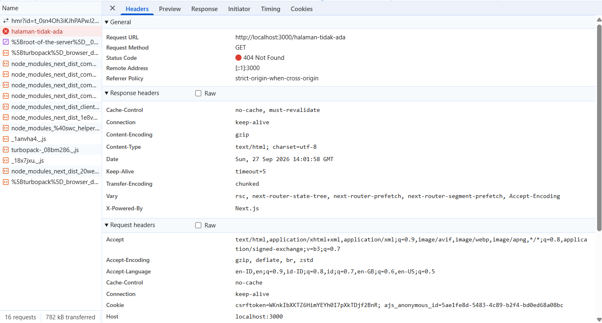
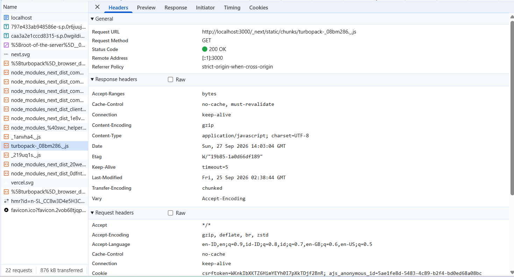
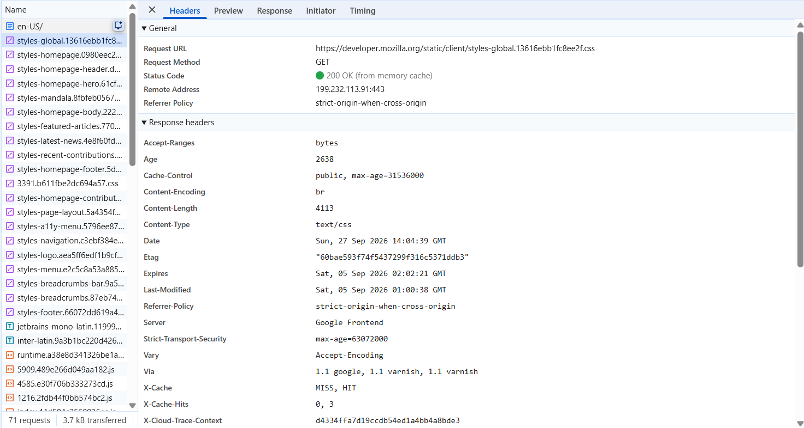

# Dokumen Teknis Modul 1 — Lingkungan Pengembangan, Git, dan Lalu Lintas HTTP

Nama/NIM : Arif Mufti Tharsa / 105224041
Repositori : https://github.com/arifmuftitharsa/praktikum-paw

## 1. Lingkungan Pengembangan

| Komponen           | Versi                           |
| ------------------ | ------------------------------- |
| Sistem Operasi     | Windows 11 (build 10.0.26200.0) |
| Node.js            | v24.19.0                        |
| npm                | 11.17.0                         |
| Git                | 2.55.0.windows.3                |
| Visual Studio Code | 1.139.0                         |

## 2. Alur Kerja Git

Keluaran `git log --oneline --graph`:

```
*   e796f7d (HEAD -> main, origin/main, origin/HEAD) Merge pull request #1 from arifmuftitharsa/docs/readme-lengkap
|\
| * b241d81 (origin/docs/readme-lengkap) docs: lengkapi teknologi dan cara menjalankan
|/
*   4fc0061 Merge branch 'latihan/konflik'
|\
| * 515e3c1 docs: perjelas deskripsi produk
* | f9abfd2 docs: ubah deskripsi produk
|/
* 19f903c feat: ganti judul halaman utama
* 8bfbb28 docs: tambahkan deskripsi produk pada README
* f78294a Initial commit from Create Next App
```

Tautan pull request yang telah digabungkan: https://github.com/arifmuftitharsa/praktikum-paw/pull/1 (Merged, commit `e796f7d`)

Konflik yang terjadi, cara penyelesaian, dan alasan pemilihan isi akhir:

Konflik terjadi pada baris deskripsi produk di README.md. Branch `main` mengubah baris tersebut menjadi "VersionRAG adalah asisten tanya jawab untuk dokumen akademik kampus yang selalu mengikuti versi terbaru", sedangkan branch `latihan/konflik` mengubahnya menjadi "VersionRAG memudahkan mahasiswa mencari aturan kampus terbaru tanpa bingung dengan versi lama". Karena kedua branch mengubah baris yang sama dengan isi berbeda, Git tidak bisa menggabungkannya otomatis dan menandai keduanya sebagai konflik.

Penyelesaian dilakukan melalui Merge Editor bawaan Visual Studio Code, yang menampilkan tiga panel: Incoming (isi dari branch yang digabungkan), Current (isi dari branch main), dan Result (isi akhir). Isi akhir yang dipilih adalah kalimat deskripsi awal, yaitu "VersionRAG membantu mahasiswa dan sivitas akademika menemukan informasi yang akurat dari dokumen dan regulasi kampus yang versinya sering berubah". Kalimat ini dipilih karena paling lengkap menyebutkan pengguna. Versi Current tidak menjelaskan VersionRAG dipakai untuk siapa, sedangkan versi Incoming hanya menyebut mahasiswa padahal sivitas akademika lain juga bisa memakainya. Versi asli mencakup keduanya sekaligus tetap menyebutkan masalahnya, yaitu dokumen dan regulasi kampus yang versinya sering berubah.

## 3. Pengamatan Lalu Lintas HTTP

Tabel 9. Lembar kerja pengamatan HTTP

| No  | URL                                          | Metode | Kode Status             | Content-Type                          | Header Lain yang Diamati                                             |
| --- | -------------------------------------------- | ------ | ----------------------- | ------------------------------------- | -------------------------------------------------------------------- |
| 1   | http://localhost:3000/                       | GET    | 200                     | text/html; charset=utf-8              | Cache-Control: no-cache, must-revalidate; Remote Address: [::1]:3000 |
| 2   | http://localhost:3000/halaman-tidak-ada      | GET    | 404                     | text/html; charset=utf-8              | Remote Address: [::1]:3000                                           |
| 3   | turbopack-_08bm286_.js (dari localhost)      | GET    | 200                     | application/javascript; charset=UTF-8 | Etag, Last-Modified                                                  |
| 4   | http://github.com (curl)                     | HEAD   | 301                     | -                                     | Location: https://github.com/                                        |
| 5   | https://developer.mozilla.org (dengan cache) | GET    | 200 (from memory cache) | text/css                              | Cache-Control: public, max-age=31536000                              |






Keluaran `curl -I` dan `curl -v`:

```
PS> curl.exe -I http://localhost:3000
HTTP/1.1 200 OK
Vary: rsc, next-router-state-tree, next-router-prefetch, next-router-segment-prefetch, Accept-Encoding
Cache-Control: no-cache, must-revalidate
X-Powered-By: Next.js
Content-Type: text/html; charset=utf-8
Date: Sun, 27 Sep 2026 14:06:23 GMT
Connection: keep-alive
Keep-Alive: timeout=5
```

```
PS> curl.exe -I http://github.com
HTTP/1.1 301 Moved Permanently
Content-Length: 0
Location: https://github.com/
```

```
PS> curl.exe -v https://example.com
* Trying [2606:4700:10::ac42:93f3]:443...
* Established connection to example.com (104.20.23.154 port 443)
* using HTTP/1.x
> GET / HTTP/1.1
> Host: example.com
> User-Agent: curl/8.21.0
> Accept: */*
>
< HTTP/1.1 200 OK
< Date: Sun, 27 Sep 2026 14:06:17 GMT
< Content-Type: text/html
< Transfer-Encoding: chunked
< Server: cloudflare
< cf-cache-status: HIT
< CF-RAY: a41b116d5bbffda3-SIN
<
<!doctype html>...<h1>Example Domain</h1>...
```

Analisis:

Perbedaan status dan ukuran antara pemuatan dengan dan tanpa cache. Pada pemuatan tanpa cache, setiap file diminta ulang ke server dan mendapat status 200 penuh. Pada pemuatan dengan cache di developer.mozilla.org, file styles-global.13616ebb1fc8ee2f.css tercatat sebagai 200 (from memory cache), artinya browser tidak mengirim request ke server sama sekali dan langsung mengambil salinan dari memori. Hal ini dimungkinkan karena header Cache-Control pada file tersebut bernilai public, max-age=31536000, yang mengizinkan penyimpanan cache hingga 365 hari. Ini berbeda dengan halaman HTML localhost yang memiliki Cache-Control: no-cache, must-revalidate, sehingga harus selalu divalidasi ulang ke server setiap kali diminta.

Alasan metode curl -I adalah HEAD. Opsi -I pada curl memberi tahu curl untuk hanya meminta header respons tanpa body, dan untuk itu curl mengirim request dengan metode HEAD, bukan GET. Hal ini terlihat pada perbedaan hasil dibandingkan permintaan browser biasa yang memakai GET.

Alasan http://github.com dialihkan. Permintaan HTTP biasa ke github.com menghasilkan status 301 Moved Permanently dengan header Location mengarah ke https://github.com/. Ini menunjukkan GitHub menerapkan kebijakan mengalihkan seluruh trafik HTTP tanpa enkripsi ke HTTPS demi keamanan koneksi. Kode 301 menandakan pengalihan bersifat permanen, berbeda dengan 302 yang bersifat sementara.

## 4. Kendala dan Penyelesaian

[TULIS KENDALA NYATA YANG DIALAMI, CONTOH DI BAWAH BISA DISESUAIKAN ATAU DIGANTI]

Saat commit README.md, muncul peringatan "LF will be replaced by CRLF the next time Git touches it". Peringatan ini disebabkan oleh perbedaan format akhir baris antara Windows (CRLF) dan Unix (LF), sebagaimana dijelaskan pada tabel Troubleshooting modul. Penyelesaiannya adalah membiarkan pengaturan bawaan Git for Windows, karena peringatan ini tidak menimbulkan galat.

Saat menyelesaikan konflik pada Bagian 3, proses merge diselesaikan melalui tombol Complete Merge pada Merge Editor Visual Studio Code. Akibatnya, commit merge yang tercatat memakai pesan bawaan "Merge branch 'latihan/konflik'", bukan pesan kustom yang direncanakan sebelumnya. Perintah git commit -m yang dijalankan setelahnya menghasilkan "nothing to commit" karena commit sudah dibuat otomatis oleh Visual Studio Code saat tombol tersebut ditekan.

## 5. Catatan Pemanfaatan AI

Alat yang dipakai: Claude Sonnet 5 di claude.ai, dan Claude Code Sonnet 5 di Claude Code Desktop.

| No  | Untuk apa                           | Prompt/perintah utama                                                                                                                                                                    | Bagian yang saya pakai                                           | Cara saya verifikasi                                                                                                                        |
| --- | ----------------------------------- | ---------------------------------------------------------------------------------------------------------------------------------------------------------------------------------------- | ---------------------------------------------------------------- | ------------------------------------------------------------------------------------------------------------------------------------------- |
| 1   | Cek struktur folder dan riwayat Git | Minta Claude Code melakukan audit tanpa mengubah apa pun, untuk melihat folder mana yang terhubung ke repositori GitHub praktikum-paw dan checkpoint mana yang sudah ada jejaknya di Git | Hasil audit dipakai sebagai panduan urutan pengerjaan Bagian E   | Saya jalankan ulang sendiri git status, git log --oneline --graph, dan git branch -a di terminal, hasilnya cocok dengan laporan Claude Code |
| 2   | Menulis README.md                   | Minta Claude Code menulis ulang README dengan kalimat deskripsi yang saya tentukan sendiri, gaya bahasa santai                                                                           | Struktur dan susunan kalimat README                              | Saya baca ulang seluruh isinya, lalu jalankan git diff README.md sebelum commit untuk memastikan tidak ada bagian tak diinginkan            |
| 3   | Bimbingan mengerjakan Modul 1       | Tanya jawab langkah demi langkah untuk Bagian A sampai H, termasuk penjelasan konsep Git dan cara membaca header HTTP di DevTools                                                        | Penjelasan konsep dipakai untuk menyusun bagian Analisis di atas | Saya bandingkan penjelasannya dengan isi Modul 1 dan cek langsung di DevTools serta terminal saya sendiri                                   |
