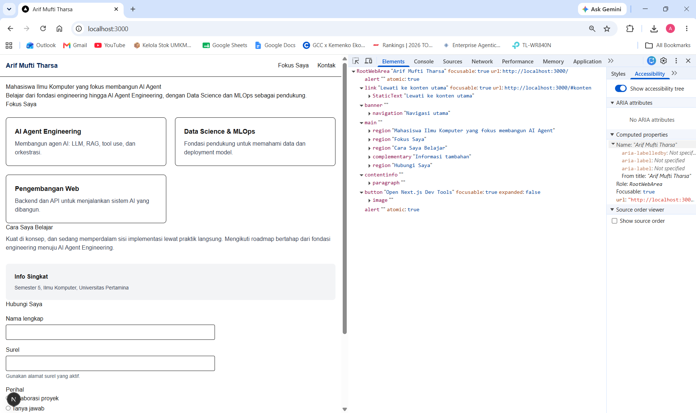
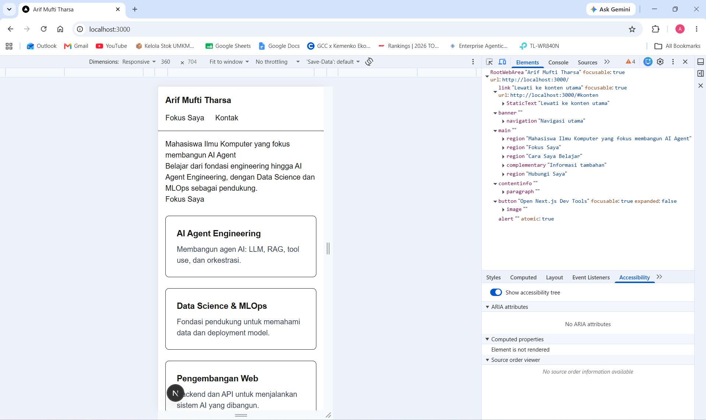
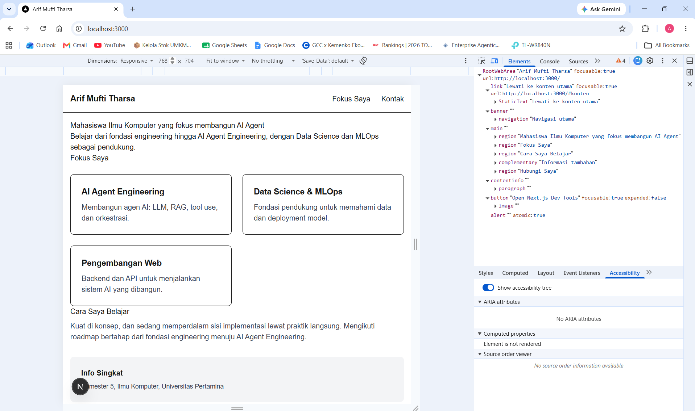
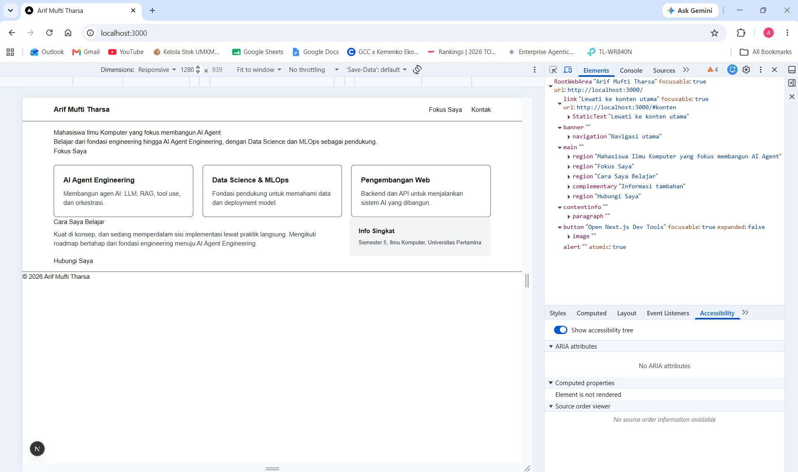
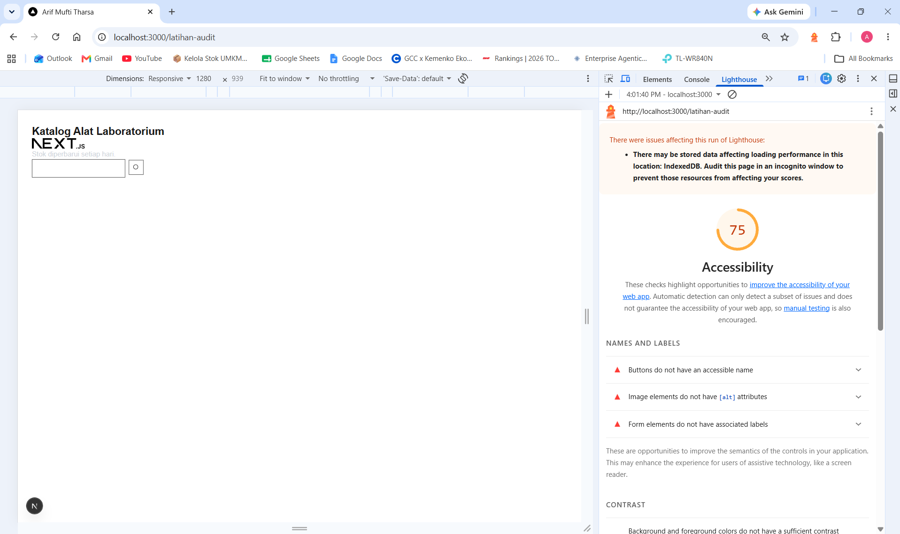
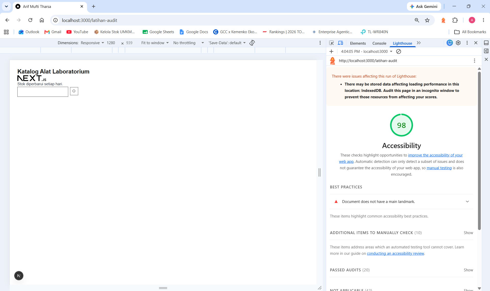
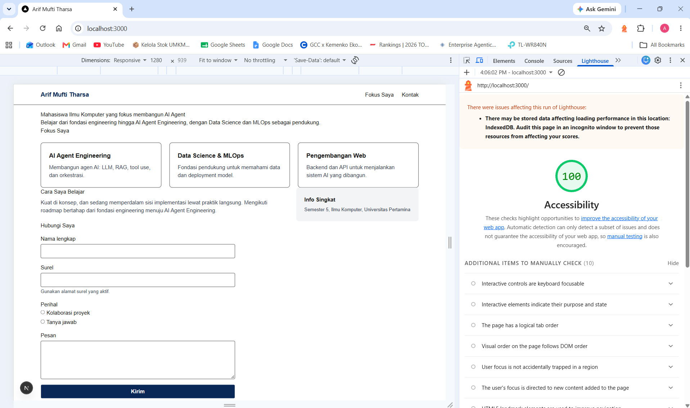
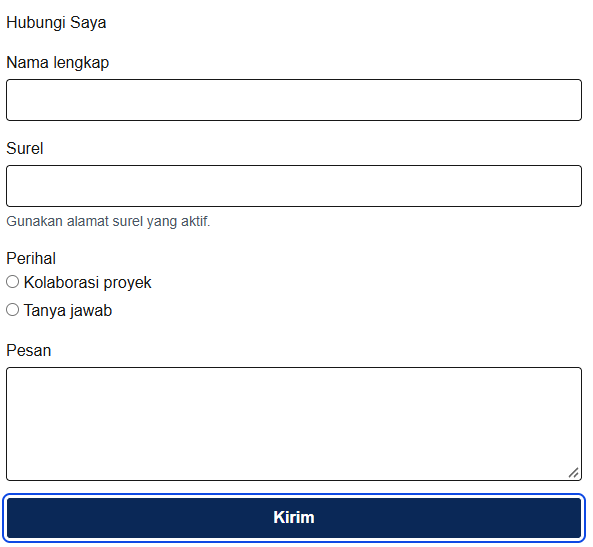

# Dokumen Teknis Modul 2 — HTML Semantik, Tailwind CSS, dan Aksesibilitas

Nama/NIM : Arif Mufti Tharsa / 105224041
Repositori : https://github.com/arifmuftitharsa/praktikum-paw

## 1. Struktur Semantik

Kerangka landmark halaman utama:

| Elemen | Peran landmark | Isi |
|---|---|---|
| `<header>` | banner | Nama dan navigasi utama |
| `<nav aria-label="Navigasi utama">` | navigation | Tautan ke Fokus Saya dan Kontak |
| `<main id="konten">` | main | Seluruh konten utama halaman |
| `<section aria-labelledby="judul-utama">` | region | Hero/pembuka |
| `<section aria-labelledby="judul-fitur">` | region | Kartu Fokus Saya |
| `<section aria-labelledby="judul-cara">` | region | Cara Saya Belajar |
| `<aside aria-label="Informasi tambahan">` | complementary | Info Singkat |
| `<section aria-labelledby="judul-kontak">` | region | Formulir kontak |
| `<footer>` | contentinfo | Hak cipta |

Hierarki judul: satu `<h1>` (kalimat hero), lima `<h2>` (satu per section/judul bagian: Fokus Saya, Cara Saya Belajar, Info Singkat memakai `<h3>` karena berada di dalam aside, Hubungi Saya), dan `<h3>` pada tiap kartu fitur serta sub-judul formulir. Tidak ada lompatan tingkat judul.

## 2. Tata Letak Responsif

Kelas Flexbox, Grid, dan breakpoint yang digunakan beserta alasannya:

| Bagian | Kelas | Alasan |
|---|---|---|
| Navigasi | `flex flex-col gap-3 p-4 sm:flex-row sm:items-center sm:justify-between` | Flexbox dipilih karena navigasi hanya perlu diatur dalam satu dimensi: logo dan menu berjajar. Mobile-first: menumpuk vertikal secara default, baru sejajar mendatar mulai breakpoint sm (640px) |
| Kartu Fokus Saya | `grid grid-cols-1 gap-6 sm:grid-cols-2 lg:grid-cols-3` | Grid dipilih karena kartu perlu diatur dalam dua dimensi sekaligus (baris dan kolom) agar tetap sejajar rapi. Jumlah kolom bertambah bertahap: 1 kolom di ponsel, 2 kolom mulai 640px, 3 kolom mulai 1024px, mengikuti lebar layar yang tersedia |
| Cara Saya Belajar + Info Singkat | `grid gap-8 lg:grid-cols-[2fr_1fr]` | Grid dengan nilai sembarang dipilih agar kolom konten utama dua kali lebih lebar dari kolom info pendukung. Pada layar sempit kedua bagian menumpuk vertikal agar tidak terlalu sempit untuk dibaca; keduanya baru berdampingan mulai breakpoint lg (1024px) |

Warna merek `--color-brand: #0b2858` ditambahkan pada blok `@theme` di `app/globals.css` dan dipakai pada nama di navigasi (`text-brand`) serta tombol kirim formulir (`bg-brand`). Warna biru dongker ini dipilih karena kontrasnya tinggi terhadap latar putih, jauh melebihi rasio minimum 4,5:1.

## 3. Audit Aksesibilitas

Tabel skor Lighthouse sebelum dan sesudah perbaikan:

| Halaman | Skor sebelum | Skor sesudah |
|---|---|---|
| Halaman latihan (`/latihan-audit`) | 75 | 98 |
| Halaman utama produk (`/`) | - | 100 |

Daftar audit yang gagal pada halaman latihan, penyebab, dan perbaikannya:

| Audit yang gagal | Penyebab | Perbaikan |
|---|---|---|
| Buttons do not have an accessible name | Tombol hanya berisi ikon SVG tanpa teks atau nama aksesibel | Menambahkan `aria-label="Cari"` pada tombol dan `aria-hidden="true"` pada SVG agar ikon tidak dibaca dua kali |
| Image elements do not have [alt] attributes | Elemen `` logo tidak memiliki atribut alt | Menambahkan `alt="Logo Next.js"` karena gambar bersifat informatif |
| Form elements do not have associated labels | Kolom pencarian tidak memiliki label yang terhubung | Menambahkan `<label htmlFor="cari-alat" className="sr-only">` yang tersembunyi secara visual namun tetap terbaca pembaca layar |
| Background and foreground colors do not have a sufficient contrast ratio | Teks menggunakan `text-gray-300` yang terlalu terang di atas latar putih | Mengganti menjadi `text-gray-700` agar rasio kontras memenuhi 4,5:1 |

Selain keempat audit otomatis tersebut, judul halaman latihan semula ditulis dengan `
` dan diganti menjadi `<h1>` agar memiliki makna semantik sebagai judul, sesuai temuan pemeriksaan manual pohon aksesibilitas.

Hasil pemeriksaan manual dengan papan ketik (urutan fokus dan garis fokus):

Formulir kontak diuji dengan menekan Tab secara berurutan dari tautan lewati-konten. Urutan fokus yang ditemukan: tautan lewati ke konten, logo navigasi, menu Fokus Saya, menu Kontak, kolom Nama lengkap, kolom Surel, pilihan radio Kolaborasi proyek, pilihan radio Tanya jawab, kolom Pesan, tombol Kirim. Urutan ini sesuai dengan urutan visual dari atas ke bawah. Garis fokus biru terlihat jelas pada setiap elemen berkat kelas `focus-visible:outline-2 focus-visible:outline-offset-2 focus-visible:outline-blue-700`. Tombol Spasi berhasil memilih opsi radio yang sedang difokuskan. Fokus tidak terjebak di area mana pun; setelah tombol Kirim, Tab berikutnya berpindah keluar dari halaman.

## 4. Kendala dan Penyelesaian

Saat memulai modul ini, sempat muncul kebingungan mengenai struktur folder proyek karena contoh dari teman menggunakan folder terpisah untuk setiap modul (`modul-1/`, `modul-2/`), masing-masing sebagai proyek Next.js baru. Setelah memeriksa kembali instruksi modul, ditemukan bahwa seluruh modul seharusnya dikerjakan pada satu repositori produk yang sama dan berkembang dari commit sebelumnya, bukan proyek terpisah. Sebagai jaring pengaman tambahan, dibuat git tag `modul-01-selesai` pada commit akhir Modul 1 agar kondisi kode pada titik tersebut tetap dapat ditelusuri kembali kapan pun meskipun berkas yang sama telah berubah di modul berikutnya.

Saat menyusun bagian tata letak responsif, sempat terjadi kesalahan penempatan kelas CSS: kelas grid untuk kartu fitur (`grid-cols-1 sm:grid-cols-2 lg:grid-cols-3`) tertukar dengan kelas untuk daftar menu navigasi saat disalin. Kesalahan terdeteksi karena menu navigasi tampil melebar tidak wajar pada lebar 360 px, sementara kartu fitur tetap tiga kolom sempit. Penyelesaiannya adalah memeriksa kembali `className` pada masing-masing elemen `<ul>` dan mengembalikannya ke tempat yang sesuai.

Perintah `npx prettier --write .` sempat dijalankan untuk mencoba alat perapi format kode, dan secara tidak sengaja ikut mengubah format tabel pada `docs/praktikum/modul-01.md` (menambah spasi agar kolom sejajar). Perubahan ini diperiksa dengan `git diff` dan dipastikan tidak mengubah isi, hanya format, sehingga aman untuk ikut di-commit bersama pekerjaan Modul 2.

## 5. Catatan Pemanfaatan AI

| No | Untuk apa | Prompt/perintah utama | Bagian yang saya pakai | Cara saya verifikasi |
|---|---|---|---|---|
| 1 | Bimbingan struktur semantik dan tata letak | Tanya jawab langkah demi langkah untuk Bagian 1 sampai 5, termasuk penjelasan konsep landmark, Flexbox, Grid, dan mobile-first | Penjelasan konsep dipakai untuk menyusun struktur halaman dan bagian Analisis pada dokumen ini | Saya bandingkan penjelasannya dengan isi Modul 2 dan periksa langsung hasilnya di DevTools serta panel Lighthouse |
| 2 | Menyusun teks konten portofolio | Meminta bantuan merangkai kalimat hero, deskripsi fokus, dan isi formulir berdasarkan data profil yang saya berikan sendiri | Susunan kalimat pada bagian hero, kartu fokus, dan cara belajar | Saya baca ulang setiap kalimat dan sesuaikan dengan apa yang sebenarnya saya rencanakan |
| 3 | Audit dan perbaikan aksesibilitas | Meminta penjelasan arah perbaikan untuk setiap temuan Lighthouse pada halaman latihan | Perbaikan `alt`, label, kontras, dan nama aksesibel tombol | Saya jalankan ulang audit Lighthouse setelah tiap perbaikan dan melihat skor naik dari 75 menjadi 98 |
